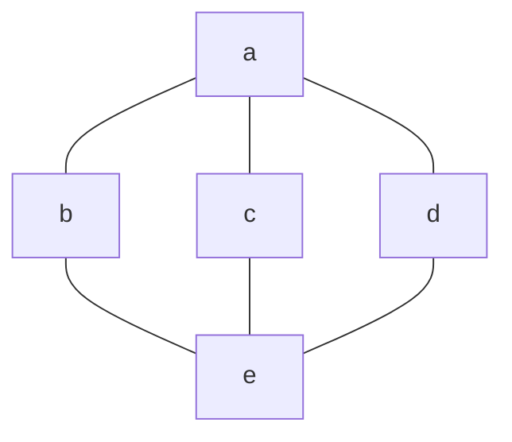
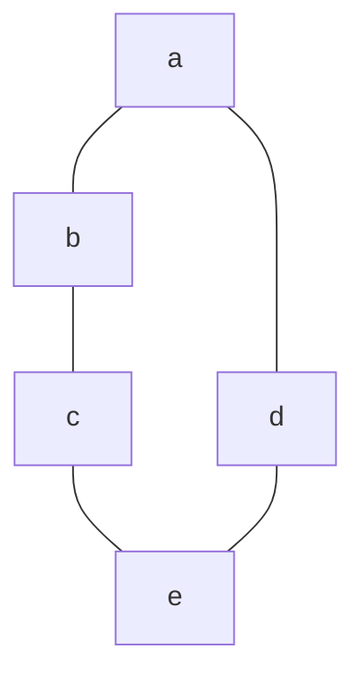

## 格
### 定义:格
> 设$(L,\land,\lor)$是代数系统,$\lor,\land$是$L$上两二元运算.称$(L,\land,\lor)$是格,唯且唯若
> 1. $\lor,\land$可结合.
> 2. $\lor,\land$可交换.
> 3. $\lor,\land$满足吸收律:$a\land(a\lor b)=a,a\land(a\lor b)=a$
> 4. $\lor,\land$幂等:$a\lor a=a,a\land a=a$

常见格有$(2^X,\cap,\cup)$,$(\mathbb{Z},min,max)$.
#### 定理：运算对偶
> 设$(L,\land,\lor)$是格,那么$a\lor b=a\iff a\land b=b$.

##### 证明:
> $a\lor b=a\implies a\land b=(a\lor b)\land b=b$
> $a\land b=b\implies a\lor b=a\lor(a\land b)=a$.

#### 定理:格蕴半序关系:确界存在
> 设$(L,\land,\lor)$是格,那么$L$中存在半序关系$\preceq=\{ (a,b)|a,b\in L,a\land b=a \}$,且
> 1. $(L,\preceq)$构成偏序集. 
> 2. 对于任何一对元素$\{ a,b \}$上下确界均存在,上确界(最小上界)$\mathrm{LUB}=a\lor b$,下确界(最大下界)$\mathrm{GLB}=a\land b$.
> 称$\preceq$是由格$L$中$\land$诱导的半序关系,该半序关系同样可以由$\lor$诱导出来,因为$a\land b=a\iff a\lor b=b$.

##### 证明:
> $\preceq=\{ (a,b)|a,b\in L,a\land b=a \}$,证明其为半序关系.
> 其自反,因$\forall a\in L,a \land a=a$
> 其反对称,因$\forall a,b\in L,a\preceq b,b\preceq a\implies a\land b=a,b\land a=b$,由交换律$a=b$
> 其传递,因$\forall a,b,c\in L,a\preceq b,b\preceq c\implies a=a\land b=a\land (b\land c)=(a\land b)\land c=a\land c\implies a\preceq c$.
> 接下来证明第二条,以上确界为例,
> 即$a\lor b$是所有元素上界,然后他是最小的.
> $a\land(a\lor b)=a,b\land (a\lor b)=b\land(b\lor a)=b\implies a\preceq(a\land b),b\preceq(a\land b)$
> 设$c$为$a,b$之任一上界,那么要证$(a\lor b)\preceq c$,即证$(a\lor b)\land c=a\lor b$.
> 又由于$a\land c=a,b\land c=b$由运算对偶有$a\lor c=c,b\lor c=c$,进而
> $(a\lor b)\lor c=a\lor(b\lor c)=a\lor c=c$,由运算对偶有$(a\lor b)\land c=a\lor b$.
> 故$(a\lor b)\preceq c$,即$(a\lor b)$是最小上界.
> 同理可以证明,$(a\land b)$是集合的下确界.

#### 引理:确界引理
> 设$(L,\preceq)$是半序集,那么:
> 1. $\mathrm{GLB}(\{ \mathrm{GLB}\{ a,b \},c \})=\mathrm{GLB}(\{ a,b,c \})$
> 2. $\mathrm{GLB}\{ a,\mathrm{GLB}\{ b,c \} \}=\mathrm{GLB}(\{ a,b,c \})$
> 3. $\mathrm{LUB}(\mathrm{LUB}\{ a,b \},c)=\mathrm{LUB}(\{ a,b,c \})$
> 4. $\mathrm{LUB}(a,\mathrm{LUB}\{ b,c \})=\mathrm{LUB}(\{ a,b,c \})$

#### 引理2:半序蕴含格
> 设$(L,\preceq)$是半序集,若对任一对元素,其上下界都存在且位于$L$中,则
> 1. $(L,\mathrm{GLB},\mathrm{LUB})$构成格;
> 2. 由$\mathrm{GLB}$诱导的半序关系$\preceq'$同原半序关系$\preceq$($\land$有诱导的)相等.
> 称半序关系$\preceq'$是伴随关系.
##### 证明:
> 首先,由确界引理,两运算都结合.
> 然后,由集合的无序性,两运算交换.
> 幂等律由$\mathrm{GLB}(\{ a,a \})=\mathrm{LUB}(\{ a,a \})=a$可得.
> 最后验证吸收律:
$$
\forall a,b:
\mathrm{GLB}(a,\mathrm{LUB}(a,b)),由a\preceq \mathrm{LUB}(a,b),a\preceq a知其为a.
$$
$$
\forall a,b:\mathrm{LUB}(a,\mathrm{GLB}(a,b)),由\mathrm{GLB}(a,b)\preceq a知其为a.
$$
> 下面证明半序关系重合,即$a\preceq'b\iff a\preceq b$.
> 新半序关系之定义为$a\preceq'b\iff \mathrm{GLB}(a,b)=a$
> 这等价于$\{ a,b \}$最大下界为$a$,即$a\preceq b$.
> 即$a\preceq'b\iff a\preceq b$.
> 证毕.
### 定义:格之等价定义
> 设$(L,\preceq)$是半序集,$\preceq$为$L$上之半序关系.若$L$中任意二元素皆有上下确界,则$(L,\preceq)$是格(或半序格).
> 描述格,既可以使用$(L,\land,\lor)$这种形式,也可以使用$(L,\preceq,\land,\lor)$这种形式,通常使用$(L,\preceq,\land,\lor)$表示格,这样就将代数及序两方面证明出来了.
> 在这样写后,$\land=\mathrm{GLB},\lor=\mathrm{LUB}$,求运算结果就是求对应的界.

下面如果没有说明,$a\preceq b\iff a\land b=a$,即采用下确界来定义半序.

#### 定理:序等价于运算对偶
> 设$(L,\preceq,\land,\lor)$是格,则$\forall a,b\in L$,
> $a\preceq b\iff a\lor b=a\iff a\land b=b$,
> 其中$\preceq$是由$\mathrm{GLB}$定义的半序关系.

##### 证明:
由$\preceq$和$\lor$诱导的半序关系相等可得.

#### 例
> $(\mathbb{N},\mathrm{GCD},\mathrm{LCM})$是格,且伴随关系是整除关系$|$,$\mathrm{GCD}$是最大公约数算符,$\mathrm{LCM}$是最小公倍数算符.
##### 解
> 算符作用结果唯一且为自然数,因而$(\mathbb{N},\mathrm{GCD},\mathrm{LCM})$是代数系统.
> 验证运算律:
> 验证半序关系:$a\preceq'b\iff \mathrm{GCD}(a,b)=a$
> 而$\mathrm{GCD}(a,b)=a$等价于$b|a$,因此可以说明伴随关系是整除.

#### 例
> $(\mathbb{N},|)$是格,且由其诱导的对偶运算是$\mathrm{GCD},\mathrm{LCM}$.

##### 解
> 首先要验证任意两个元素上下确界都存在.
> 如果$a|b$,那么$\mathrm{GCD}(a,b)=a,\mathrm{LCM}(a,b)=b$,那么上下界存在,下界为$\mathrm{GCD}$,上界为$\mathrm{LCM}$.
> 下面证明下确界,$c|a,c|b$则$c|\mathrm{GCD}(a,b)$这说明$\mathrm{GCD}$是下确界.
> 同理可以说明,$\mathrm{LCM}$是上确界.
> 因此$(\mathbb{N},|,\mathrm{GCD},\mathrm{LCM})$是格.

### 定理:对偶原理(Duality Principle)
> 设$(L,\preceq,\land,\lor)$是格,$\succeq$是$\preceq$逆关系,那么以下两条成立
> 1. $(L,\succeq,\lor,\land$)是格,称该格为原格之对偶格(互为对偶格).
> 2. 若$T$是原格中已经证明的定理,那么对$T$条件和结论都作以下两点操作后,定理在原来的格中仍然成立.
> 	1. 将$\preceq$变为$\succeq$;
> 	2. 将$\land$与$\lor$互易.
### 定理:运算保序性
> 设$(L,\land,\lor)$是格,那么$\forall a,b,c\in L$
> 1. $a\preceq b\iff a\land c\preceq b\land c$
> 2. $a\preceq b\iff a\lor c\preceq b\lor c$

### 定理:分配不等式
> 设$(L,\land,\lor)$是格,那么$\forall a,b,c\in L$
> 1. $a\lor(b\land c)\preceq (a\lor c)\land(a\lor c)$
> 2. $(a\land b)\lor(a\land c)\preceq a\land(b\lor c)$

### 定理:模不等式
> 设$(L,\land,\lor)$是格,那么$\forall a,b,c\in L$
> 1. $(a\land b)\lor(a\land c)\preceq a\land(b\lor(a\land c))$
> 2. $(a\lor(b\land(a\lor c)))\preceq(a\lor b)\land(a\lor c)$

### 定义:模律
> 设$(X,\land,\lor)$是代数系统,$\land,\lor$是上面的二元运算.称它们满足*模律*,唯且唯若$\forall a,b,c\in L$
> 1. $(a\land b)\lor(a\land c)= a\land(b\lor(a\land c))$
> 2. $(a\lor b)\land(a\lor c)=(a\lor(b\land(a\lor c)))$
> 这表明从中间"截断算式"不改变算式的结果.

### 定义:模格
> 设$(L,\land,\lor)$是格,运算$\land,\lor$满足模律,则称格$L$是*模格*.

#### 定理:模格判定定理(充要条件)
> 设$(\preceq,\land,\lor)$是格,那么他是模格唯且唯若
$$
\forall a,b,c\in L,a\preceq c\iff a\lor(b\land c)=(a\lor b)\land c
$$
##### 例
> $(2^X,\subseteq,\cap,\cup)$是模格.

##### 例(L1)
> 下面Hesse图表示的格是模格.

###### 证明

##### 例(L2)
> 下面Hesse图表示的格不是模格.

### 定义:分配格
> 设$(L,\land,\lor)$是格,如果$\land$对$\lor$分配且$\lor$对$\land$分配,那么称格$L$是*分配格*.

##### 例
> $(2^X,\subseteq,\cap ,\cup)$是分配格.
> 上面最后一个例子提到的格不是分配格.

#### 定理:Birkhoff定理
> 一个格不是分配格,唯且唯若其有同例L1及例L2两格同构之子格; 或
> 一个格是分配格,唯且唯若其无同例L1及例L2两格同构之子格.
> 称例L1格为$M_{5}$,例L2格为$N_{5}$.

#### 定理:分配格是模格
> 分配格一定是模格.

#### 定理:分配格有消去律
> 分配格$(L,\land,\lor)$两运算有
> $(a\land b=a\land c)且(a\lor b=a\lor c)\iff b=c$.

### 定义:全序格
> 若格$(L,\preceq,\land,\lor)$的半序关系$\preceq$是全序关系,则称该格为*全序格*.

#### 定理:全序格是分配格
> 全序格一定是分配格.

##### 例
> $(\mathbb{Z},\leq,min,max)$是全序格,因而是分配格.

### 定义:有界格
> 设$(L,\preceq,\land,\lor)$是格,$L$存在最小元及最大元,则称其为*有界格*.
> 若某个格是有界格,其最小元为m及最大元为M,则一般将格记作$(L,\preceq,\land,\lor,m,M)$.

#### 定理:有限格必为有界格
> 有限格必为有界格,而无限格不一定是有界格.

### 定义:有补格
> 设$(L,\preceq,\land,\lor,m,M)$是有界格,
> 1. $a\in L,$若$\exists b\in L\implies a\land b=0,a\lor b=1$,则称$b$是$a$之*补元*.
> 2. 若每个元素都有补元,那么称该格为*有补格*.

例L1中的格是有补格.

| 元素  | 补元  |
| :-: | :-: |
|  a  |  e  |
|  b  | c d |
|  c  | b d |
|  d  | b c |
|  e  |  a  |

#### 定理:补元条件唯一
> 设$(L,\preceq,\land,\lor,m,M)$是有界分配格,对$\forall a\in L,$若$a$有补元,则补元唯一.

##### 证明
> $\forall a\in L,\exists b,c\in L,a\land b=m=a\land c$,由消去律,$b=c$.

#### 推论:补运算
> 由于有补分配格中元素的补唯一,那么可以定义一元运算补$'$,将格记为$(L,\preceq,\land,\lor,',0,1)$,其中0是最小元,1是最大元.
> 称这种格叫做集合代数.